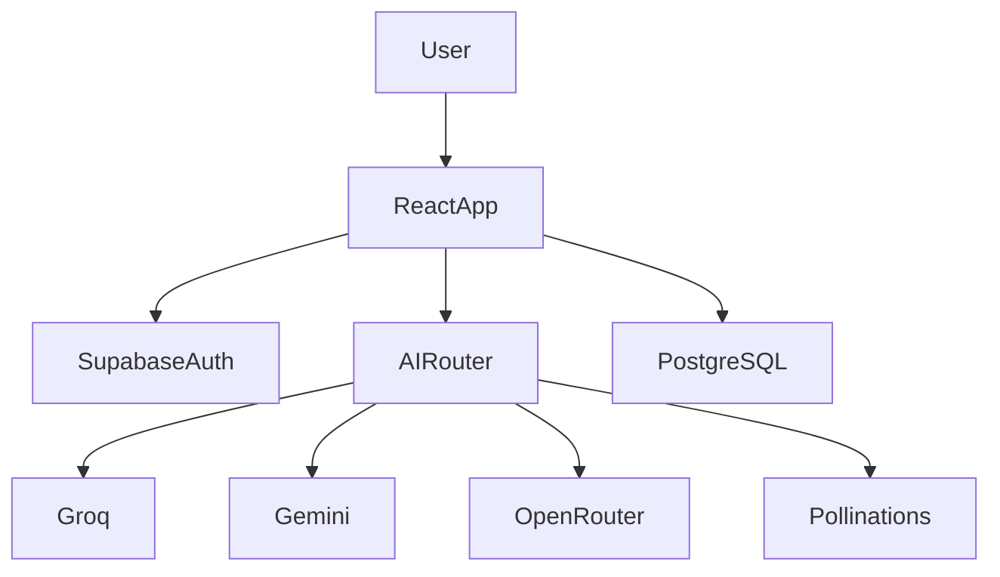

# AI Station

[](https://ai-station.tech)
[](https://github.com/shreyas3013/ai-station.tech)
[](https://react.dev)
[

AI Station is a production-ready AI platform that unifies multiple AI providers behind a single intelligent interface. It features automatic model routing, streaming responses, voice input/output, image generation, code analysis, session sharing, and persistent chat history.

## Live Platform

- Website: https://ai-station.tech
- Repository: https://github.com/shreyas3013/ai-station.tech

## Core Features

| Feature | Status |
|----------|--------|
| Intelligent AI Routing | ✅ |
| Multi-Provider Support | ✅ |
| Streaming Responses | ✅ |
| Voice Input | ✅ |
| Text-to-Speech | ✅ |
| Image Generation | ✅ |
| Authentication | ✅ |
| Chat Sharing | ✅ |
| DOCX Export | ✅ |
| Code Review | ✅ |
| Persistent Sessions | ✅ |
| Temporary Mode | ✅ |

## Technology Stack

### Frontend
- React
- TypeScript
- Vite
- Tailwind CSS
- Framer Motion
- Three.js
- Zustand
- React Query

### Backend
- Supabase
- PostgreSQL
- Supabase Edge Functions

### AI Providers
- Google Gemini
- Groq
- OpenRouter
- Pollinations AI

## Architecture




## Installation

```bash
git clone https://github.com/shreyas3013/ai-station.tech.git
cd ai-station.tech
npm install
npm run dev
```

### Environment Variables

```env
VITE_SUPABASE_URL=your_url
VITE_SUPABASE_PUBLISHABLE_KEY=your_key
```

Server-side secrets:

```env
GROQ_API_KEY=...
GEMINI_API_KEY=...
OPENROUTER_API_KEY=...
```

## Project Structure

```text
src/
├── components/
├── pages/
├── store/
├── hooks/
├── lib/
├── integrations/
└── test/
```

## Security

- API keys stored in Supabase Edge Function secrets
- JWT-based authentication
- Protected routes
- Session management via Supabase Auth
- No provider credentials exposed to the browser

## Performance

- Lazy loading
- Code splitting
- Streaming architecture
- Zustand state management
- Debounced autocomplete

## Software Requirements

- Node.js 18+
- npm 9+
- Modern browser
- Supabase project

## Hardware Requirements

### Development
- Dual-core CPU
- 4 GB RAM minimum
- Internet connection

### Recommended
- Quad-core CPU
- 8 GB RAM
- SSD storage

## Roadmap

- Multi-model routing
- Streaming responses
- Voice features
- Image generation
- Code Station

## Academic Context

AI Station was developed as a B.Tech Computer Science Engineering project and demonstrates full-stack development, AI integration, authentication, database design, and scalable software architecture.

## License

MIT License
